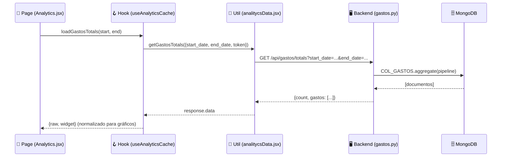

# 🎓 Curso Vanellix Method — Arquitectura Full-Stack

> **Para:** El hermano de Vanellix  
> **Stack:** FastAPI (Python) + React + Vite + TailwindCSS + MongoDB  
> **Filosofía:** Pages → Hooks → Utils → Backend

---

## 📐 La Filosofía: Las 4 Capas

```
┌─────────────────────────────────────────────────┐
│                   USUARIO                       │
├─────────────────────────────────────────────────┤
│  📄 PAGE        → Lo que VES (JSX + Tailwind)   │
│  🪝 HOOK        → La LÓGICA (estado + efectos)  │
│  🔧 UTIL        → El TRANSPORTE (fetch al API)  │
│  🖥️ BACKEND API → Los DATOS (FastAPI + Mongo)   │
└─────────────────────────────────────────────────┘
```

> [!IMPORTANT]
> **Regla de oro:** Cada capa solo habla con su vecina inmediata.  
> La Page NUNCA hace fetch directo. El Hook NUNCA renderiza HTML. El Util NUNCA accede a MongoDB.

### Flujo de datos real



---

## 📁 Estructura de Directorios

### Frontend (`frontend-vite/src/`)

```
src/
├── pages/                    # 📄 CAPA 1: Páginas (vistas)
│   ├── analytics/
│   │   ├── Analytics.jsx     # Página principal + pageMetadata
│   │   └── components/       # Sub-componentes de esta página
│   │       ├── AnalyticsView.jsx
│   │       └── widgets/      # Widgets reutilizables de analytics
│   ├── pagesConfig.js        # 🧭 Router automático (lee pageMetadata)
│   ├── categoryOrder.json    # Orden de categorías en sidebar
│   └── navigationLinks.json  # Links de navegación estáticos
│
├── hooks/                    # 🪝 CAPA 2: Lógica
│   ├── useAnalyticsCache.jsx # Hook de analytics (caché inteligente)
│   └── useAdminData.jsx      # Hook genérico de admin
│
├── utils/                    # 🔧 CAPA 3: Transporte HTTP
│   ├── api.jsx               # Axios wrapper base
│   ├── analitycsData.jsx     # Funciones fetch de analytics
│   └── normalizeForWidget.js # Transformar data → formato widget
│
├── locales/                  # 🌐 Traducciones (es/en/it/pt)
│   ├── es/analytics.json
│   ├── en/analytics.json
│   └── ...
│
└── components/               # 🧩 Componentes compartidos
    ├── widgets/              # Widgets genéricos (GastosWidget, etc.)
    ├── common/               # UI común (botones, modales)
    └── Sidebar.jsx           # Lee pagesConfig automáticamente
```

### Backend (`backend/`)

```
backend/
├── main.py                   # FastAPI app + auto-discovery de routers
├── apis/
│   └── analytics/
│       ├── __init__.py
│       ├── analytics.py      # Router: /db/collections (admin)
│       ├── gastos.py         # Router: /gastos/* (4 endpoints)
│       └── ventas.py         # Router: /ventas/* (4 endpoints)
├── utils/
│   ├── auth/session.py       # verify_session (Depends)
│   └── web3mongo.py          # Conexión a MongoDB
└── config/roles/
    ├── access_gastos.py      # Permisos por sucursal (gastos)
    └── access_locals.py      # Permisos por local (ventas)
```

---

## 🔑 Conceptos Clave

### 1. `pageMetadata` — El DNI de cada página

Cada archivo `.jsx` en `pages/` exporta un objeto `pageMetadata`. Este objeto le dice al sistema **dónde mostrar la página, quién puede verla y cómo se llama**.

```javascript
// Al final de tu archivo de página:
export const pageMetadata = {
  path: '/app/analytics/analysis',   // Ruta en el router
  label: 'analytics.label',          // Clave i18n para el nombre
  category: 'analytics.category',    // Categoría en sidebar
  minRoleLevel: 3,                   // Rol mínimo (3=admin)
  maxRoleLevel: 6,                   // Rol máximo
  order: 1,                          // Posición dentro de la categoría
  locations: ['sidebar'],            // Dónde aparece: sidebar/header/footer
  description: 'analytics.description', // i18n para tooltip
  icon: 'FaChartBar',               // Ícono de react-icons/fa
  isSearchable: true,                // ¿Aparece en búsqueda global?
};
```

> [!TIP]
> **`pagesConfig.js` escanea automáticamente** todos los `.jsx` usando `import.meta.glob`. No necesitas registrar rutas manualmente. Solo exporta `pageMetadata` y tu página aparece en el sidebar.

### 2. `categoryOrder.json` — Orden del sidebar

```json
{
  "restaurant.category":  { "order": 1, "icon": "FaUtensils" },
  "carta.category":       { "order": 2, "icon": "FaBook" },
  "delivery.category":    { "order": 3, "icon": "FaTruck" },
  "analytics.category":   { "order": 4, "icon": "FaChartBar" },
  "merits.category":      { "order": 5, "icon": "FaTrophy" },
  "team.category":        { "order": 6, "icon": "FaUsers" },
  "marketing.category":   { "order": 7, "icon": "FaBullhorn" },
  "admin.category":       { "order": 8, "icon": "FaShieldAlt" }
}
```

### 3. Locales (i18n) — Todo texto es una clave

Nunca escribas texto hardcodeado. Usa `t('analytics.mi_clave')`.

```json
// src/locales/es/analytics.json
{
  "label": "Analítica",
  "category": "Analítica",
  "description": "Dashboard de ventas y gastos",
  "dashboard": "Análisis",
  "projection": "Proyección",
  "valuation": "Valorización"
}
```

### 4. Tailwind Dark/Light — La regla del dual

Siempre usa **ambas variantes**:

```jsx
// ✅ CORRECTO — siempre light + dark
<div className="bg-light-surface dark:bg-dark-surface text-light-text-primary dark:text-dark-text-primary">

// ❌ INCORRECTO — solo un modo
<div className="bg-white text-black">
```

Los colores del sistema están en [tailwind.config.js](file:///Users/vanellix/Piccola_delivery_web3/piccola_italia_web3/frontend-vite/tailwind.config.js):

| Token | Light | Dark |
|-------|-------|------|
| `*-background` | `#F5F5F5` | `#0A0A0A` |
| `*-surface` | `#FFFFFF` | `#1A1A1A` |
| `*-surface-secondary` | `#E5E7EB` | `#2A2A2A` |
| `*-text-primary` | `#111827` | `#FFFFFF` |
| `*-text-secondary` | `#6B7280` | `#B0B0B0` |
| `*-accent` (verde) | `#009246` | `#009246` |
| `*-error` (rojo) | `#CE2B37` | `#CE2B37` |
| `*-border` | `#D1D5DB` | `#333333` |

### 5. El wrapper `api.jsx` — Cómo hablar con el backend

```javascript
// src/utils/api.jsx — Wrapper de Axios
const api = async ({ method, endpoint, data, headers, withCredentials }) => {
  const response = await axios({
    method,
    url: `${API_URL}${endpoint}`,   // API_URL viene de .env
    headers: { ...headers },
    data,
    withCredentials,
  });
  return response.data;
};
```

Todas las funciones en `utils/` usan este wrapper. **Nunca llames a `axios` directamente.**

---

## 🏗️ Ejercicio Práctico: Informe de Gastos

Vamos a recorrer cómo funciona el módulo de gastos que ya existe, capa por capa, para que entiendas el patrón completo.

### CAPA 4: Backend — [gastos.py](file:///Users/vanellix/Piccola_delivery_web3/piccola_italia_web3/backend/apis/analytics/gastos.py)

El backend expone **4 endpoints** con un `APIRouter`:

```python
router = APIRouter()
COL_GASTOS = db.gastos_intranet  # Colección MongoDB

# 1. Fechas disponibles (público)
@router.get("/gastos/available-dates")

# 2. Listado crudo (con permisos)
@router.get("/gastos")

# 3. Resumen anidado por categoría (con permisos)
@router.get("/gastos/summary")

# 4. Totales agrupados por día (rápido para widgets)
@router.get("/gastos/totals")
```

**Patrón del endpoint `/gastos/totals`:**

```python
@router.get("/gastos/totals")
async def get_gastos_totals(
    start_date: str = Query(...),          # Parámetro obligatorio
    end_date: str   = Query(...),
    by: str         = Query("resumen2"),    # Agrupación dinámica
    user: dict = Depends(verify_session),   # Auth automática
):
    perms = get_perms_from_user(user)       # 1. Extraer permisos
    pipeline = [...]                         # 2. Construir pipeline MongoDB
    result = list(COL_GASTOS.aggregate(pipeline))  # 3. Ejecutar
    return {"count": len(result), "gastos": result} # 4. Retornar
```

> [!NOTE]
> **Auto-discovery:** `main.py` escanea automáticamente `apis/**/*.py` y registra todos los `router` que encuentra. No necesitas importar manualmente cada API.

### CAPA 3: Util — [analitycsData.jsx](file:///Users/vanellix/Piccola_delivery_web3/piccola_italia_web3/frontend-vite/src/utils/analitycsData.jsx)

Función que conecta con el endpoint:

```javascript
export async function getGastosTotals({
  start_date, end_date, by = 'resumen2',
  include_daily = true, exclude_cuentas = [],
  walletAddress, token,
}) {
  const params = new URLSearchParams({ start_date, end_date, by });
  // ... agregar filtros opcionales ...
  return api({
    method: 'GET',
    endpoint: `/gastos/totals?${params.toString()}`,
    withCredentials: true,
    headers: {
      ...(token ? { Authorization: `Bearer ${token}` } : {}),
      ...(walletAddress ? { 'X-Wallet-Address': walletAddress } : {}),
    },
  });
}
```

**Patrón:** Recibe parámetros → construye `URLSearchParams` → llama a `api()` → retorna la respuesta.

### CAPA 2: Hook — [useAnalyticsCache.jsx](file:///Users/vanellix/Piccola_delivery_web3/piccola_italia_web3/frontend-vite/src/hooks/useAnalyticsCache.jsx)

El hook maneja **estado, caché y normalización**:

```javascript
export default function useAnalyticsCache(appState, cacheKey) {
  const [gastosWidget, setGastosWidget] = useState([]);
  const [loading, setLoading] = useState(false);

  const loadGastosTotals = useCallback(async (start, end, opts) => {
    setLoading(true);
    const res = await getGastosTotals({ start_date, end_date, ... });
    let widgetRows = normalizeForWidget(res.gastos, { ... });
    widgetRows = indexTimeline(widgetRows);
    setGastosWidget(widgetRows);
    return { raw: res.gastos, widget: widgetRows };
  }, [wallet, token]);

  return { loadGastosTotals, gastosWidget, loading };
}
```

> [!TIP]
> `normalizeForWidget()` transforma cualquier respuesta del backend en el formato `{label, value, date}` que los widgets de gráficos necesitan. Es **el puente universal** entre datos crudos y la UI.

### CAPA 1: Page — [Analytics.jsx](file:///Users/vanellix/Piccola_delivery_web3/piccola_italia_web3/frontend-vite/src/pages/analytics/Analytics.jsx)

La página **solo orquesta**. No tiene lógica de fetch ni transformación:

```javascript
const Analytics = ({ appState }) => {
  const { t } = useTranslation();
  const { loadGastosTotals, loading } = useAnalyticsCache(appState);
  const [gastos, setGastos] = useState([]);

  const handleApply = async () => {
    const result = await loadGastosTotals(startStr, endStr, { ... });
    setGastos(result?.widget || []);
  };

  return (
    <div className="w-full p-4 text-light-text-primary dark:text-dark-text-primary">
      <GastosWidget data={gastos} loading={loading} />
    </div>
  );
};

export default Analytics;
export const pageMetadata = { path: '/app/analytics/analysis', ... };
```

---

## 🛠️ Tu Primera Feature: Ventas por Hora

Ahora que conoces el patrón, así se crearía un informe de "ventas por hora":

### Paso 1: Backend — `backend/apis/analytics/ventas_hora.py`

```python
from fastapi import APIRouter, Depends, Query
from utils.auth.session import verify_session
from utils.web3mongo import db

router = APIRouter()
COL = db.ventas_locales

@router.get("/ventas/por-hora")
async def get_ventas_por_hora(
    start_date: str = Query(...),
    end_date: str = Query(...),
    user: dict = Depends(verify_session),
):
    # Pipeline que agrupa por hora del día
    pipeline = [
        {"$match": {"fecha": {"$gte": start_date, "$lte": end_date}}},
        {"$group": {
            "_id": {"$hour": "$fecha"},
            "total": {"$sum": "$total"},
            "count": {"$sum": 1},
        }},
        {"$sort": {"_id": 1}},
    ]
    result = list(COL.aggregate(pipeline))
    return {"count": len(result), "data": result}
```

### Paso 2: Util — `src/utils/ventasHoraData.jsx`

```javascript
import api from './api.jsx';

export async function getVentasPorHora({ start_date, end_date, token, walletAddress }) {
  const params = new URLSearchParams({ start_date, end_date });
  return api({
    method: 'GET',
    endpoint: `/ventas/por-hora?${params.toString()}`,
    withCredentials: true,
    headers: {
      ...(token ? { Authorization: `Bearer ${token}` } : {}),
      ...(walletAddress ? { 'X-Wallet-Address': walletAddress } : {}),
    },
  });
}
```

### Paso 3: Hook — `src/hooks/useVentasHora.jsx`

```javascript
import { useState, useCallback } from 'react';
import { getVentasPorHora } from '../utils/ventasHoraData';

export default function useVentasHora(appState) {
  const [data, setData] = useState([]);
  const [loading, setLoading] = useState(false);
  const [error, setError] = useState(null);

  const load = useCallback(async (start, end) => {
    setLoading(true);
    setError(null);
    try {
      const res = await getVentasPorHora({
        start_date: start, end_date: end,
        token: appState?.token,
        walletAddress: appState?.account,
      });
      setData(res?.data || []);
      return res?.data || [];
    } catch (e) {
      setError(e);
    } finally {
      setLoading(false);
    }
  }, [appState?.token, appState?.account]);

  return { data, loading, error, load };
}
```

### Paso 4: Page — `src/pages/analytics/VentasHora.jsx`

```jsx
import React, { useState } from 'react';
import { useTranslation } from 'react-i18next';
import useVentasHora from '../../hooks/useVentasHora';

const VentasHora = ({ appState }) => {
  const { t } = useTranslation();
  const { data, loading, load } = useVentasHora(appState);

  return (
    <div className="w-full p-4 min-h-screen
      text-light-text-primary dark:text-dark-text-primary">
      <h1 className="text-xl font-bold mb-4">
        {t('analytics.ventas_hora_title')}
      </h1>
      {/* Tu contenido aquí */}
    </div>
  );
};

export default VentasHora;

export const pageMetadata = {
  path: '/app/analytics/ventas-hora',
  label: 'analytics.ventas_hora_label',
  category: 'analytics.category',
  minRoleLevel: 3,
  maxRoleLevel: 6,
  order: 3,
  locations: ['sidebar'],
  description: 'analytics.ventas_hora_desc',
  icon: 'FaClock',
  isSearchable: true,
};
```

### Paso 5: Locale — `src/locales/es/analytics.json`

Agregar las claves nuevas:

```json
{
  "ventas_hora_label": "Ventas por Hora",
  "ventas_hora_title": "Informe de Ventas por Hora",
  "ventas_hora_desc": "Análisis de ventas agrupadas por franja horaria"
}
```

---

## 📋 Checklist para Cualquier Feature Nueva

```
□ 1. BACKEND  → apis/<modulo>/<feature>.py  (router + endpoints)
□ 2. UTIL     → utils/<feature>Data.jsx     (funciones fetch)
□ 3. HOOK     → hooks/use<Feature>.jsx      (estado + lógica)
□ 4. PAGE     → pages/<modulo>/<Feature>.jsx (vista + pageMetadata)
□ 5. LOCALE   → locales/es/<modulo>.json    (textos en español)
□ 6. LOCALE   → locales/en/<modulo>.json    (textos en inglés)
□ 7. ICON     → No duplicar íconos en la misma categoría
□ 8. THEME    → Siempre light + dark en cada className
```

> [!CAUTION]
> **Nunca hagas:**
> - `import ... from 'main'` (causa circular imports)
> - Texto hardcodeado en JSX (usa `t('clave')`)
> - `axios.get()` directo (usa el wrapper `api()`)
> - Solo `bg-white` sin `dark:bg-dark-surface`
> - Duplicar un ícono (`FaCog`) en dos páginas de la misma categoría

---

## 🔗 Archivos de Referencia

| Capa | Archivo Canónico | Descripción |
|------|-------------------|-------------|
| Backend | [gastos.py](file:///Users/vanellix/Piccola_delivery_web3/piccola_italia_web3/backend/apis/analytics/gastos.py) | 4 endpoints con permisos y pipelines MongoDB |
| Backend | [ventas.py](file:///Users/vanellix/Piccola_delivery_web3/piccola_italia_web3/backend/apis/analytics/ventas.py) | Patrón de ventas + clima |
| Util | [analitycsData.jsx](file:///Users/vanellix/Piccola_delivery_web3/piccola_italia_web3/frontend-vite/src/utils/analitycsData.jsx) | Todas las funciones fetch de analytics |
| Util | [api.jsx](file:///Users/vanellix/Piccola_delivery_web3/piccola_italia_web3/frontend-vite/src/utils/api.jsx) | Wrapper base de Axios |
| Util | [normalizeForWidget.js](file:///Users/vanellix/Piccola_delivery_web3/piccola_italia_web3/frontend-vite/src/utils/normalizeForWidget.js) | Normalizador de datos → widgets |
| Hook | [useAnalyticsCache.jsx](file:///Users/vanellix/Piccola_delivery_web3/piccola_italia_web3/frontend-vite/src/hooks/useAnalyticsCache.jsx) | Hook con caché inteligente |
| Page | [Analytics.jsx](file:///Users/vanellix/Piccola_delivery_web3/piccola_italia_web3/frontend-vite/src/pages/analytics/Analytics.jsx) | Página principal + pageMetadata |
| Config | [pagesConfig.js](file:///Users/vanellix/Piccola_delivery_web3/piccola_italia_web3/frontend-vite/src/pages/pagesConfig.js) | Auto-discovery de rutas |
| Config | [categoryOrder.json](file:///Users/vanellix/Piccola_delivery_web3/piccola_italia_web3/frontend-vite/src/pages/categoryOrder.json) | Orden de sidebar |
| Theme | [tailwind.config.js](file:///Users/vanellix/Piccola_delivery_web3/piccola_italia_web3/frontend-vite/tailwind.config.js) | Sistema de colores dual |